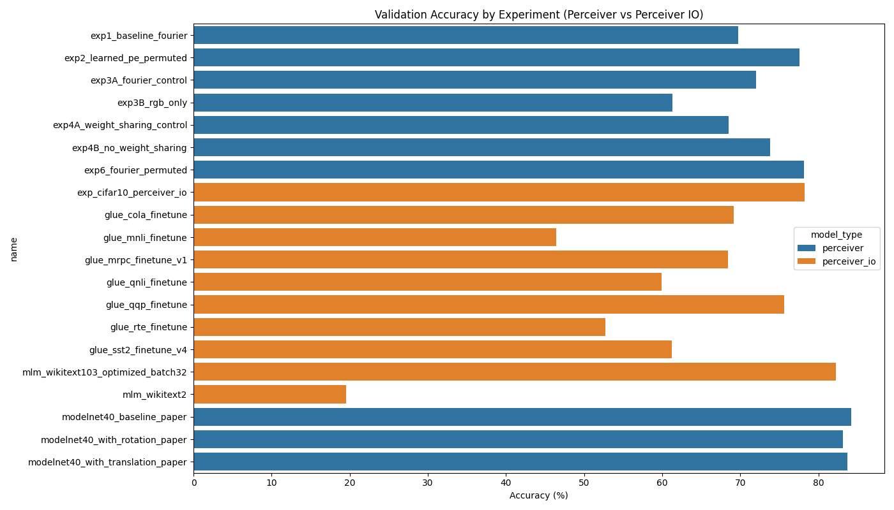
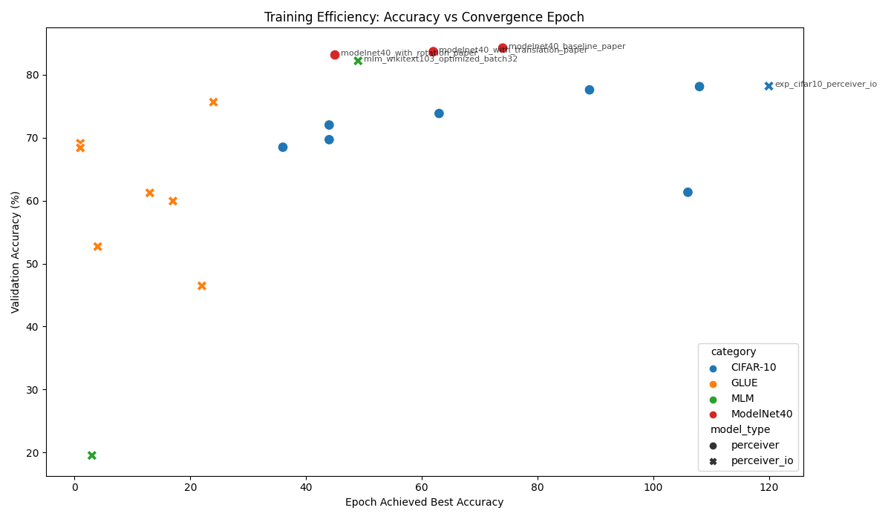
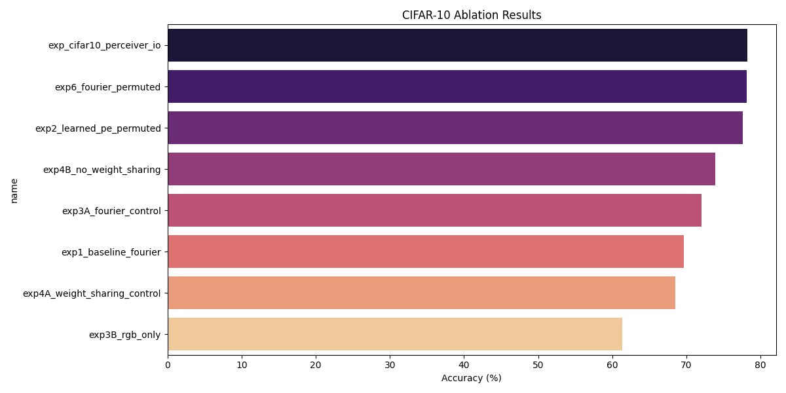
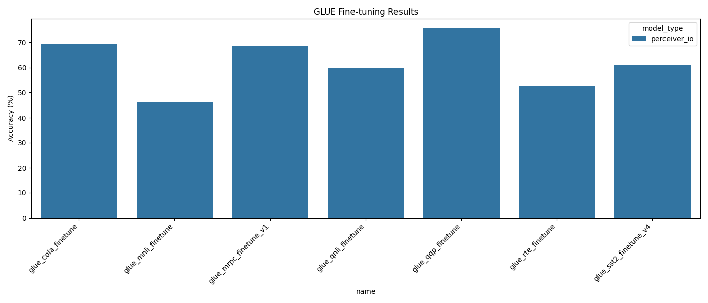
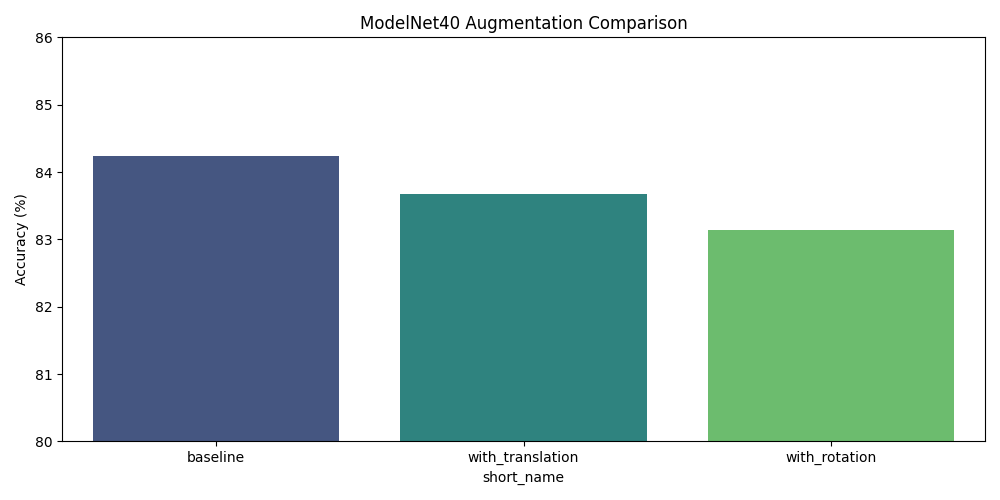

# 📊 Perceiver Project - Consolidated Report
**Generated:** 2026-02-23 21:51

## 🏆 Top Performers
### CIFAR-10
- **perceiver**: `exp6_fourier_permuted` — **78.12%** (Epoch 108)
- **perceiver_io**: `exp_cifar10_perceiver_io` — **78.20%** (Epoch 120)

### GLUE
- **perceiver_io**: `glue_qqp_finetune` — **75.65%** (Epoch 24)

### MLM
- **perceiver_io**: `mlm_wikitext103_optimized_batch32` — **82.20%** (Epoch 49)

### ModelNet40
- **perceiver**: `modelnet40_baseline_paper` — **84.24%** (Epoch 74)

## 📈 Visualization

## 📋 Detailed Results

### CIFAR-10 Experiments

**Model Type: perceiver**
| Experiment | Accuracy | Epoch | Status | Loss |
|------------|----------|-------|--------|------|
| `exp6_fourier_permuted` | **78.12%** | 108 | Completed | - |
| `exp2_learned_pe_permuted` | **77.60%** | 89 | Completed | - |
| `exp4B_no_weight_sharing` | **73.85%** | 63 | Completed | - |
| `exp3A_fourier_control` | **72.02%** | 44 | Completed | - |
| `exp1_baseline_fourier` | **69.69%** | 44 | Completed | - |
| `exp4A_weight_sharing_control` | **68.49%** | 36 | Completed | - |
| `exp3B_rgb_only` | **61.34%** | 106 | Completed | - |

**Model Type: perceiver_io**
| Experiment | Accuracy | Epoch | Status | Loss |
|------------|----------|-------|--------|------|
| `exp_cifar10_perceiver_io` | **78.20%** | 120 | Completed | - |

### GLUE Experiments

**Model Type: perceiver_io**
| Experiment | Accuracy | Epoch | Status | Loss |
|------------|----------|-------|--------|------|
| `glue_qqp_finetune` | **75.65%** | 24 | Completed | - |
| `glue_cola_finetune` | **69.13%** | 1 | Completed | - |
| `glue_mrpc_finetune_v1` | **68.38%** | 1 | Completed | - |
| `glue_sst2_finetune_v4` | **61.24%** | 13 | Completed | - |
| `glue_qnli_finetune` | **59.93%** | 17 | Completed | - |
| `glue_rte_finetune` | **52.71%** | 4 | Completed | - |
| `glue_mnli_finetune` | **46.47%** | 22 | Completed | - |
| `glue_stsb_finetune_v1` | **MSE 2.2800** | 4 | Completed | - |

### MLM Experiments

**Model Type: perceiver_io**
| Experiment | Accuracy | Epoch | Status | Loss |
|------------|----------|-------|--------|------|
| `mlm_wikitext103_optimized_batch32` | **82.20%** | 49 | Completed | - |
| `mlm_wikitext2` | **19.54%** | 3 | Completed | - |

### ModelNet40 Experiments

**Model Type: perceiver**
| Experiment | Accuracy | Epoch | Status | Loss |
|------------|----------|-------|--------|------|
| `modelnet40_baseline_paper` | **84.24%** | 74 | Completed | - |
| `modelnet40_with_translation_paper` | **83.67%** | 62 | Completed | - |
| `modelnet40_with_rotation_paper` | **83.14%** | 45 | Completed | - |
